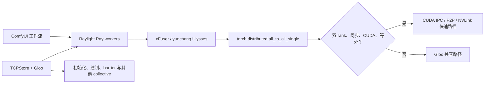

# Raylight Windows 双 V100 CUDA P2P

[简体中文](README.md) | [English](README_EN.md)

> **实验性 Preview**
> 面向原生 Windows、双 Tesla V100-SXM2-16GB、TCC 与 NVLink 的 Raylight
> CUDA IPC/P2P 通信分支。它不是通用 NCCL 替代，也不提供 Windows FSDP。

本项目让 Raylight 在符合条件的双卡 Ulysses
`torch.distributed.all_to_all_single` 调用中，绕开 Gloo 的 CPU 主存数据中转，
通过 CUDA IPC、跨进程 CUDA Event 和 GPU P2P 访问传输张量。Gloo/TCPStore
仍负责初始化、控制、barrier 以及不符合快速路径条件的通信。

## 上游与作者声明

本仓库是 [Raylight](https://github.com/komikndr/raylight) 的实验性分支，
上游项目由 **Komikndr / Micko Lesmana** 创建和维护。Raylight 使用 Ray 管理
ComfyUI 多 GPU worker，并结合 xDiT/xFuser、yunchang 和 FSDP 实现并行能力。

- 上游仓库：<https://github.com/komikndr/raylight>
- 本分支的上游基线：Raylight 1.9.0，提交
  `9a7c33d52b3d35e29f75ecff3c227de987f0d4cf`
- 许可证：Apache License 2.0
- 分支修改说明：[WINDOWS_P2P_CHANGES.md](WINDOWS_P2P_CHANGES.md)
- 持续测试记录：[docs/TESTING.md](docs/TESTING.md)

本项目保留上游许可证、版权与归属信息。Windows P2P 兼容层、测试、脚本和
文档是此分支新增的实验性工作，不代表上游作者对该 Windows 实现作出支持承诺。

## 项目定位

### 适合谁

本分支面向以下使用场景：

- 必须使用原生 Windows，不希望迁移到 WSL/Linux。
- 使用两张 Tesla V100-SXM2-16GB，并已切换到 TCC 模式。
- 两卡之间有可用 NVLink/CUDA P2P，希望 Raylight 的序列并行通信实际走 GPU
  P2P，而不是通过 CPU 主存中转。
- 接受 Ray 在 Windows 上仍属于 Beta、功能与性能弱于 Linux + NCCL。
- 愿意固定经过验证的软件版本，并在运行工作流前执行完整自检。

### 它解决什么

- 为 Raylight 的双 rank、同步、等分 CUDA `all_to_all_single` 提供专用 P2P
  快速路径。
- 保留 Gloo 作为 Windows 可用的进程组、控制面和兼容回退。
- 启动时同时验证元素正确性和真实 P2P 带宽。
- 在配置不变时复用健康的 Ray worker，减少重复初始化开销。
- 提供真实 LTX 张量尺寸的正确性、故障和性能探针。

### 它不是什么

- 不是 yunchang 的替代或 fork。yunchang 仍负责 Ulysses attention 与张量拆分。
- 不是完整的 Windows NCCL 实现。
- 不是通用 PyTorch `ProcessGroup`。
- 不支持 Windows FSDP，也不能把两张 16GB 显卡简单等同为一张 32GB 显卡。
- USP 主要拆分序列计算；模型权重通常仍会在每张卡各保留一份。

## 支持范围

### 当前快速路径的硬性条件

| 项目 | 要求 |
|---|---|
| 操作系统 | 原生 64 位 Windows，单机 |
| GPU | 恰好两张可见 CUDA GPU |
| 已验证型号 | 2× Tesla V100-SXM2-16GB |
| 驱动模式 | 两卡均为 TCC；WDDM 未支持、未验证 |
| GPU 通信 | CUDA peer access、CUDA IPC、跨进程 CUDA Event 可用 |
| Ray worker | 两个 worker / 两个 rank |
| 并行配置 | Ulysses=2，Ring=1，CFG=1，DP=1 |
| Collective | 同步、CUDA、连续张量、等分 `all_to_all_single` |
| FSDP | 必须关闭 |

物理上是否通过同一个 PCIe 插槽、载板或桥接芯片连接，不是代码判断条件。
真正的准入标准是 CUDA P2P 能否工作，以及完整探针的正确性与带宽是否达标。

### 已验证软件矩阵

| 组件 | 已验证版本 |
|---|---|
| Windows | NT build 22631.6199 / 23H2 |
| NVIDIA 驱动 | 577.00 |
| Python | 3.10.11 x64 |
| PyTorch | 2.7.0+cu126 |
| torchvision | 0.22.0+cu126 |
| torchaudio | 2.7.0+cu126 |
| xformers | 0.0.30 |
| Ray | 2.57.0 |
| xFuser | 0.4.5 |
| yunchang | 0.6.4 |
| ComfyUI | 0.31.0，提交 `62b3c94bd45154f6486c7abf1b9efcacee96ea69` |
| Raylight 上游基线 | 1.9.0，提交 `9a7c33d52b3d35e29f75ecff3c227de987f0d4cf` |
| Attention | `TORCH_EFFICIENT`，不安装 FlashAttention |

机器可读版本清单见
[environment-windows-v100.json](environment-windows-v100.json)，Python 依赖见
[requirements-windows-v100.txt](requirements-windows-v100.txt)。

## 用户指南

### 1. 准备硬件和驱动

在继续前确认：

1. 两张 V100 均处于 TCC 模式。
2. `nvidia-smi nvlink -s` 能看到活动链路。
3. NVIDIA `p2pBandwidthLatencyTest` 的 peer access、正确性和带宽测试通过。
4. 系统没有残留的 ComfyUI/Ray worker 占用 GPU。

开发机器每张 V100 检测到 6 条约 `25.781 GB/s` 的 NVLink，项目完整探针
测得约 `59 GiB/s` 单向远端有效传输带宽。其他拓扑可以尝试，但必须通过自检。

### 2. 安装固定版本环境

建议使用独立 Python 3.10.11 环境，不要直接改动其他 ComfyUI 环境。

```powershell
$PY = "<你的 Python 3.10.11 路径>\python.exe"
cd <ComfyUI>\custom_nodes
git clone --branch windows-v100-p2p `
  https://github.com/getsomefuns/raylight-windows-v100-p2p.git raylight

& $PY -m pip install -r .\raylight\requirements-windows-v100.txt
& $PY -m pip install -e .\raylight
```

注意：

- V100 验证环境固定为 `torch==2.7.0+cu126`。
- 不要为这个配置安装 FlashAttention。
- 不要把它替换成 cu128/cu130 PyTorch wheel；此分支验证的是包含 `sm_70`
  支持的 cu126 wheel。
- 上游 Raylight 的宽松依赖范围不足以保证本分支使用的 PyTorch CUDA IPC
  私有接口长期兼容，因此复现时应使用锁定文件。

### 3. 运行环境自检

先运行不占用 Ray worker 的基础检查：

```powershell
cd <ComfyUI>\custom_nodes\raylight
.\scripts\verify-windows-v100.ps1 -PythonPath $PY
```

再运行真正的双 Ray actor CUDA P2P 发布门槛：

```powershell
.\scripts\verify-windows-v100.ps1 -PythonPath $PY -RunP2PProbe
```

完整探针会检查：

- Windows、Python、PyTorch 和关键依赖版本。
- 两张 GPU 的型号与 TCC 模式。
- NVLink 链路是否可见。
- 双 Ray actor CUDA IPC/P2P 元素正确性。
- 115,343,360 字节真实尺寸传输是否达到默认 `50 GiB/s` 门槛。

任何一项失败都不应直接运行大型工作流。降低带宽门槛只会移除保护，不会改善硬件。

### 4. 启动 ComfyUI

验证路径与参数但不真正启动：

```powershell
.\scripts\start-comfyui-windows-p2p.ps1 `
  -PythonPath $PY `
  -ValidateOnly
```

正式启动：

```powershell
.\scripts\start-comfyui-windows-p2p.ps1 -PythonPath $PY
```

默认打开：

```text
http://127.0.0.1:8188
```

脚本相当于使用以下关键 ComfyUI 参数：

```text
main.py --listen 127.0.0.1 --port 8188 --disable-cuda-malloc
```

`--disable-cuda-malloc` 对已验证的 V100 VAE 路径是必要条件，用于避免
`cudaErrorNotSupported / operation not supported`。当前默认脚本没有添加
`--highvram` 或 `--disable-smart-memory`。

### 5. 网卡选择

Gloo 默认自动选择本机 IPv4。如果 Windows 选中了 VPN、Hyper-V、WSL 或 TUN
网卡，可以显式指定物理网卡地址：

```powershell
.\scripts\start-comfyui-windows-p2p.ps1 `
  -PythonPath $PY `
  -GlooHost <物理网卡 IPv4>
```

仓库没有写入开发机器的局域网 IP。

### 6. 加载 LTX 2.3 示例工作流

示例工作流：

[example_workflows/LTX2_3_i2v_Raylight_Windows_P2P.json](example_workflows/LTX2_3_i2v_Raylight_Windows_P2P.json)

模型与自定义节点清单：

[docs/ltx23-model-manifest.md](docs/ltx23-model-manifest.md)

上游示例输入图片随仓库保留：

[example_workflows/LTX2_3_i2v_Raylight.jpg](example_workflows/LTX2_3_i2v_Raylight.jpg)

原版与 Windows P2P 版 LTX 工作流都包含测试提示词，并引用这个图片文件名。运行前请将
该图片复制到 ComfyUI 的 `input` 目录，或在 `Load Image` 节点中重新选择它。仓库仍不
包含模型权重；模型文件需要从模型作者认可的来源另行取得。

RayInitializer 使用以下设置：

| 设置 | 值 |
|---|---:|
| GPU | 2 |
| ulysses_degree | 2 |
| ring_degree | 1 |
| cfg_degree | 1 |
| dp_degree | 1 |
| sync_ulysses | true |
| clear_vram_after_sampling | true |
| FSDP / FSDP_CPU_OFFLOAD | false / false |
| XFuser_attention | TORCH_EFFICIENT |
| skip_comm_test | true |
| use_mmap | true |

`skip_comm_test=true` 只跳过 Raylight 原有的通用通信测试，不会跳过此分支的
CUDA P2P 正确性和带宽检查。

### 7. 确认实际启用了 P2P

首次初始化应看到类似日志：

```text
[Raylight] Windows Gloo init OK ...
[Raylight] Windows CUDA P2P enabled: ...
```

配置不变的后续任务应看到：

```text
[Raylight] Reusing 2 live Ray workers for unchanged configuration
```

如果 P2P 初始化、正确性或带宽检查失败，受支持的快速路径会直接报错，不会把同一次
受支持操作静默降级为主存中转后继续假装使用 NVLink。

## 启动脚本设置了什么

| 设置 | 默认值 | 作用 |
|---|---:|---|
| `PYTHONUTF8` | `1` | 统一 Windows/Ray 日志编码 |
| `PYTHONIOENCODING` | `utf-8` | 避免 worker 输出乱码 |
| `USE_LIBUV` | `0` | 使用不依赖 libuv 的 TCPStore |
| `MASTER_ADDR` | `127.0.0.1` | 本机 distributed rendezvous |
| `MASTER_PORT` | `29500` | rendezvous 端口 |
| `RAY_DEBUG_DISABLE_MEMORY_MONITOR` | `1` | 避免 Ray 因高内存占用提前杀 worker |
| `RAY_memory_usage_threshold` | `1` | 将 Ray 内存阈值提高到 100% |
| `RAYLIGHT_WINDOWS_P2P` | `1` | 启用 Windows CUDA P2P 快速路径 |
| `RAYLIGHT_WINDOWS_P2P_CAPACITY_BYTES` | `134217728` | 每 rank 128 MiB 持久发送缓冲区 |
| `RAYLIGHT_WINDOWS_P2P_MIN_GIB_S` | `50` | 启动带宽硬门槛 |
| `CUDA_VISIBLE_DEVICES` | `0,1` | 固定两张目标 GPU 的可见顺序 |

内存监控覆盖可能让系统在压力过高时进入换页；它是为了避免 Ray 过早终止大型工作流，
不是免费的性能优化。请监控系统内存和 swap/pagefile。

## 技术说明

### 数据路径



yunchang/xFuser 继续调用标准 `torch.distributed.all_to_all_single`。Ray worker
内部安装的路由器只拦截符合以下条件的调用：

- input/output 都在 CUDA。
- `async_op=False`。
- 没有显式 `input_split_sizes` 或 `output_split_sizes`。
- group world size 为 2。
- 张量连续、dtype 和元素数量一致，远端半块不超过缓冲区容量。

其他调用保留原 Gloo 实现。已匹配快速路径的调用如果发生 P2P 错误，会 poison 当前
endpoint，阻止在通信状态不一致时继续执行。

### P2P 实现

核心实现位于：

- `src/raylight/distributed_worker/windows_p2p.py`
- `src/raylight/distributed_worker/windows_gloo.py`
- `src/raylight/distributed_worker/ray_worker.py`
- `src/raylight/distributed_worker/parallel_group_manager.py`
- `src/raylight/nodes.py`

每个 rank 持有：

- 一个默认 128 MiB 的持久 CUDA 发送缓冲区。
- 可导出的 CUDA IPC storage handle。
- `ready` 和 `consumed` 跨进程 CUDA Event。
- Windows named shared memory + event 控制面。
- 单独 CUDA stream、递增 operation ID、超时和 poison 状态。

发送方先把本 rank 需要发送的半块写入持久缓冲区并记录 ready event；对端在确认双方
operation ID 和尺寸一致后，等待 CUDA Event 并直接从 peer buffer 复制到输出张量。

### Gloo 仍然负责什么

Windows Gloo/TCPStore 仍负责：

- 两个 Ray worker 的 rendezvous 和进程组初始化。
- xFuser subgroup 的建立。
- 控制、barrier 以及不满足快速路径条件的 collective。
- COMM tester 在 Windows 下的兼容路径。

因此，本项目应称为 **Raylight Windows CUDA P2P 数据面兼容层**，不能称为
“Windows NCCL”。

### Ray worker 复用

RayInitializer 会根据拓扑、并行配置、GPU 选择和 P2P/Gloo 环境生成稳定 session
key。配置相同且 worker 健康时复用现有 actor；配置改变或健康探测失败时清除缓存并
重新初始化。它减少 Ray 生命周期开销，但不保证所有模型权重永久驻留 GPU。

## CUDA 版本说明

同一台机器可能同时看到三个 CUDA 数字：

- `nvidia-smi CUDA Version`：驱动支持的 CUDA API 上限。
- `nvcc --version`：本机安装的 CUDA 开发工具包。
- `torch.version.cuda`：PyTorch wheel 实际绑定的 CUDA 运行时。

本项目运行时最重要的是第三项：已验证值为 CUDA 12.6，即
`torch==2.7.0+cu126`。当前 Python 实现没有自编译 CUDA 扩展，因此运行分支本身
不要求本机安装 CUDA Toolkit 12.9；编译 NVIDIA CUDA samples 时才需要 Toolkit。

## 测试与实测数据

### 发布前验证

- Windows P2P、trace、session、runtime、mmap、metadata、模型加载同步和发布配置测试均纳入持续测试；当前结果以 [测试记录](docs/TESTING.md) 与实际测试命令输出为准。
- 真实 LTX 张量尺寸：516,096、8,388,608、28,835,840 和
  115,343,360 字节。
- 两个 rank、全部尺寸：`0 mismatch / 0 maximum error`。
- operation ID 不一致、缺失 peer：约 2 秒内按预期超时。
- xFuser 双 rank subgroup 集成探针通过。
- 115,343,360 字节、100 次 P2P 探针：约 `59.27 GiB/s` 每方向。

### LTX 2.3 端到端基准

同一模型、输入、提示词、工作流规模下：

| 场景 | 端到端耗时 |
|---|---:|
| 单 V100 冷启动 | 519.94 s |
| 单 V100 热启动 | 316.60 s |
| 双 V100 P2P 复用会话中位数 | 284.06 s |

公平的热对热提升：

```text
(316.60 - 284.06) / 316.60 = 10.28%
```

量化 safetensors 现在可在 `use_mmap=true` 时保留 metadata 并延迟映射；两个 rank 使用共同的最小显存预算加载模型，并在加载后同步。10 秒工作流仍以严格 10 秒通信超时验证，不通过放宽超时掩盖 rank 偏差。

当前版本已经证明真实双 GPU 工作、正确 CUDA P2P 数据路径和稳定生成，但尚未达到
项目希望的“比单卡热启动快至少 20%”目标。文档不会用单卡冷启动作为基线夸大收益。

## 已知限制

- 只支持单机、两个 rank、等分同步 all-to-all 快速路径。
- WDDM 未验证；发行门槛要求 TCC。
- FSDP 在此 Windows 路径中必须关闭。
- GGUF 不能通过此实现获得 FSDP 权重分片。
- LTX/LTXAV 应保持 ComfyUI 默认 BF16/FP32 推理范围；实测强制全局 FP16 会产生全黑视频和音频 NaN/Inf。
- 不支持多 GPU 文本编码、VAE 编码/解码。
- 模型权重通常每卡一份，显存不是简单相加。
- 小张量的 Python、named control、同步和 event 开销仍明显。
- Ray Windows 支持仍为 Beta，进程启动和内存开销高于 Linux。
- 其他 GPU、驱动和 NVLink 拓扑必须自行通过完整自检，不能仅凭型号推断兼容。

## 常见问题

### 网页打不开

确认启动窗口仍在运行，并检查：

```powershell
Invoke-WebRequest http://127.0.0.1:8188/ -UseBasicParsing
```

没有监听通常表示 ComfyUI 尚未启动完成或已经退出。先查看启动日志，不要把网页问题
误判为 Raylight/P2P 故障。

### `use_libuv was requested`

使用仓库启动脚本。它会设置 `USE_LIBUV=0`，同时显式使用
`TCPStore(..., use_libuv=False)`。

### Gloo 连接 `WorkStudio` 或错误网卡

使用 `-GlooHost <物理网卡 IPv4>`。不要把某台机器的局域网 IP 写进公共脚本。

### P2P 低于 50 GiB/s

检查 TCC、NVLink 链路、peer access、GPU 拓扑以及是否有其他进程占用 GPU。只有在
你理解性能后果时才调整 `-MinimumP2PGiBs`。

### VAE `operation not supported`

确保通过本项目脚本启动，并保留 `--disable-cuda-malloc`。

### 启用了 FSDP 后报错

这是预期保护。Windows P2P 分支不实现 FSDP；将 FSDP 与 CPU Offload 都关闭。

## 仓库结构

```text
raylight/
├─ src/raylight/                         Raylight 与 Windows P2P 实现
├─ scripts/
│  ├─ start-comfyui-windows-p2p.ps1     通用启动脚本
│  └─ verify-windows-v100.ps1           环境和真实 P2P 自检
├─ tests/                                单元测试与独立探针
├─ example_workflows/                    LTX 2.3 示例工作流
├─ docs/
│  ├─ windows-v100-p2p.md               Windows 专项技术指南
│  ├─ ltx23-model-manifest.md            模型与节点清单
│  ├─ TESTING.md                         持续测试与验证总表
│  └─ test-results-2026-08.csv           精简测试数据附件
├─ environment-windows-v100.json         机器可读验证矩阵
├─ requirements-windows-v100.txt         锁定依赖
└─ WINDOWS_P2P_CHANGES.md                相对上游的修改说明
```

## 后续优化方向

- 把热对热端到端提升推进到 20% 以上。
- 分析微基准约 108 GiB/s 与项目通信约 59 GiB/s 的差距。
- 降低小 collective 的 Python、控制面和同步开销。
- 评估多 buffer/ring slot、批量控制和更深流水。
- 在保持严格正确性与超时保护的前提下减少额外本地 copy。
- 在获得真实硬件验证后扩展支持矩阵，而不是只增加未经测试的型号声明。

## 安全与可再分发内容

仓库包含源码、脚本、测试、配置，以及上游随项目发布的示例工作流和配套素材。
其中，LTX 2.3 原版工作流、Windows P2P 测试工作流、内置提示词和上游示例输入图片
均保留在 `example_workflows` 目录中。

仓库不包含：

- 模型权重、LoRA、VAE 或文本编码器。
- 测试生成的视频输出。
- 完整 Python/ComfyUI 环境快照。

模型权重和未随仓库提供的其他素材，应由用户从授权来源自行取得，并遵守各自许可证。

## 许可证与致谢

本项目继续遵循上游 Raylight 的 Apache License 2.0，详见 [LICENSE](LICENSE)。

感谢以下项目及其贡献者：

- [Raylight](https://github.com/komikndr/raylight) — Komikndr / Micko Lesmana
- [xDiT / xFuser](https://github.com/xdit-project/xDiT)
- [yunchang / Long Context Attention](https://github.com/feifeibear/long-context-attention)
- [Ray](https://github.com/ray-project/ray)
- [PyTorch](https://github.com/pytorch/pytorch)
- [ComfyUI](https://github.com/Comfy-Org/ComfyUI)

如需报告问题，请附上环境验证脚本输出、错误日志、RayInitializer 设置和最小复现
工作流；请先删除令牌、个人路径、图片和模型下载凭据。
