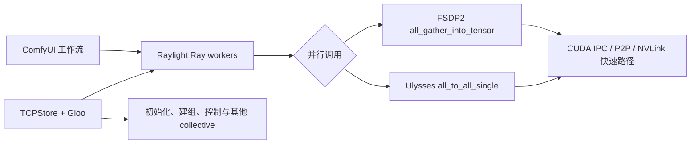

# Raylight Windows 双 V100 FSDP + CUDA P2P

[简体中文](README.md) | [English](README_EN.md)

> **实验性 Preview**
> 面向原生 Windows、双 Tesla V100-SXM2-16GB、TCC 与 NVLink 的 Raylight
> FSDP2 权重分片与 CUDA IPC/P2P 通信分支。

本项目在上一阶段 Windows P2P/Ulysses 实现的基础上，增加了 FSDP2 所需的
`all_gather_into_tensor` CUDA 数据路径。经过验证的 LTX 2.3 Diffusion Model
会在两张 V100 之间真正分片；聚合权重和 Ulysses 张量通过 CUDA IPC、跨进程
CUDA Event 与 GPU P2P/NVLink 传输。Gloo/TCPStore 仍只负责初始化、建组和控制面。

在此基础上，分支现已验证 LTX 2.3 与 MiniMax H3 Diffusion Model 的 Windows 双卡 FSDP 路径，并为 MiniMax H3 提供可直接载入的 Turbo8 I2V 和 Turbo4 REF2VA 工作流。

MiniMax H3 O6 现已加入显式 `fp16_h3_safe` 模式：FP32 数值岛保护残差与敏感输出，主 Attention/MLP 分支使用 FP16。正式 I2V/REF2VA 采样分别达到 3.299×/3.416×，REF2VA 的当前最佳实验配置达到 3.714×；质量验收通过，但 4× 初始门槛尚未通过。完整的实装、资源数据和失败实验见[中文升级记录](docs/releases/2026-08-18-o6-minimax-h3-safe-fp16.zh-CN.md)与[英文升级记录](docs/releases/2026-08-18-o6-minimax-h3-safe-fp16.en.md)。

当前实现不是完整的 Windows NCCL，也不是通用 PyTorch `ProcessGroup`。它是针对
单机、双 rank、Windows V100 推理所需 collective 的定向兼容层。

## 上游与作者声明

本仓库是 [Raylight](https://github.com/komikndr/raylight) 的实验性分支，
上游项目由 **Komikndr / Micko Lesmana** 创建和维护。Raylight 使用 Ray 管理
ComfyUI 多 GPU worker，并结合 xDiT/xFuser、yunchang 和 FSDP 实现并行能力。

- 上游仓库：<https://github.com/komikndr/raylight>
- 本分支的上游基线：Raylight 1.9.0，提交
  `9a7c33d52b3d35e29f75ecff3c227de987f0d4cf`
- 许可证：Apache License 2.0
- 上一阶段 P2P/Ulysses 修改说明：[WINDOWS_P2P_CHANGES.md](WINDOWS_P2P_CHANGES.md)
- FSDP 修改说明：[WINDOWS_FSDP_CHANGES.md](WINDOWS_FSDP_CHANGES.md)
- FSDP 测试与验收：[docs/WINDOWS_V100_FSDP_TESTING.md](docs/WINDOWS_V100_FSDP_TESTING.md)
- P2P/Ulysses 历史测试：[docs/TESTING.md](docs/TESTING.md)
- MiniMax H3 O6 安全 FP16 升级记录：[中文](docs/releases/2026-08-18-o6-minimax-h3-safe-fp16.zh-CN.md) / [English](docs/releases/2026-08-18-o6-minimax-h3-safe-fp16.en.md)

本项目保留上游许可证、版权与归属信息。Windows P2P 兼容层、测试、脚本和
文档是此分支新增的实验性工作，不代表上游作者对该 Windows 实现作出支持承诺。

## 项目定位

### 适合谁

本分支面向以下使用场景：

- 必须使用原生 Windows，不希望迁移到 WSL/Linux。
- 使用两张 Tesla V100-SXM2-16GB，并已切换到 TCC 模式。
- 两卡之间有可用 NVLink/CUDA P2P，希望 LTX 2.3 或 MiniMax H3 的 FSDP 权重聚合与序列并行
  通信实际走 GPU P2P，而不是通过 CPU 主存中转。
- 接受 Ray 在 Windows 上仍属于 Beta、功能与性能弱于 Linux + NCCL。
- 愿意固定经过验证的软件版本，并在运行工作流前执行完整自检。

### 它解决什么

- 让已验证的 LTX 2.3 与 MiniMax H3 Diffusion Model 持久权重分片保存在两张 16GB V100 上。
- 支持 MiniMax H3 FP8-scaled checkpoint、FSDP CPU offload、官方 Turbo LoRA、同 checkpoint 热复用和切换 checkpoint 时的 worker 回收。
- 为 FSDP2 的 CUDA `all_gather_into_tensor` 和 Ulysses 的
  `all_to_all_single` 提供专用 P2P 快速路径。
- 保留 Gloo 作为 Windows 可用的进程组、控制面和兼容回退。
- 启动时同时验证元素正确性和真实 P2P 带宽。
- 在配置不变时复用健康的 Ray worker，减少重复初始化开销。
- 提供真实 LTX 张量尺寸的正确性、故障和性能探针。

### 它不是什么

- 不是 yunchang 的替代或 fork。yunchang 仍负责 Ulysses attention 与张量拆分。
- 不是完整的 Windows NCCL 实现。
- 不是通用 PyTorch `ProcessGroup` 或完整的 ProcessGroupNCCL 替代。
- 不能把两张 16GB 显卡简单等同为一张透明的 32GB 显卡。
- 不会自动分片整个 ComfyUI 工作流；当前 FSDP 范围是通过 `RayUNETLoader`
  加载的 Diffusion Model。
- 当前不支持 GGUF + FSDP、多于两个 rank、多机和训练反向传播。

## 当前 FSDP 实现与能力边界

### 当前结论

当前 `windows-v100-fsdp-p2p` 分支已经实现并验证：

> 在原生 Windows、双 V100 TCC、NVLink 环境下，用 PyTorch FSDP2 对
> LTX 2.3 与 MiniMax H3 Diffusion Model 做真实权重分片，并用自定义 CUDA IPC/P2P
> all-gather 替代 NCCL 的关键数据通信路径。

这不表示整个 ComfyUI 工作流中的所有模型都会自动分片，也不表示两张 16GB GPU
变成了一张透明的 32GB GPU。当前解决的是已验证 Diffusion Model 的单卡显存容量问题；模型支持必须逐项验收。

### 两张 GPU 是否参与计算

是。以下数据来自最终通过视觉验收的 LTX FSDP + 原始 BF16 LoRA 运行：

- GPU0 峰值：16,224 MiB、100%、354.54W。
- GPU1 峰值：16,156 MiB、100%、348.43W。
- 487 个监控样本中，189 个样本两卡利用率同时超过 80%，284 个样本同时超过 50%。
- 双卡高负载样本的平均利用率约为 94.8% / 95.0%。
- 两个 rank 在两阶段采样返回的视频/音频 latent 逐元素完全一致。

两卡不是在工作流的每个阶段都同时满载：

| 工作流阶段 | GPU0 | GPU1 | 当前原因 |
|---|---:|---:|---|
| 文本编码、图片预处理 | 主要工作 | 多数空闲 | 普通 ComfyUI 节点，没有 FSDP |
| Diffusion Sampler 1 | 高负载 | 高负载 | FSDP 双 rank 采样 |
| Latent Upscale | 主要工作 | 多数空闲 | 普通 Upscaler 节点 |
| Diffusion Sampler 2 | 高负载 | 高负载 | FSDP 双 rank 采样 |
| Video/Audio VAE 解码 | 主要工作 | 多数空闲 | 当前工作流使用普通 VAE 节点 |

MiniMax H3 I2V 和 REF2VA 的已验收运行同样证明两个 rank 完成采样且两卡达到高利用率。
所以准确表述是：**FSDP 扩散采样阶段双卡共同运算；整个工作流并非始终双卡满载。**

### 权重如何分片和计算

当前实现不是“前一半层在 GPU0，后一半层在 GPU1”，而是：

1. 每个 FSDP 权重张量分成两份，两个 rank 各长期保存一份。
2. 当前层计算前，两份权重通过 CUDA P2P/NVLink 临时 all-gather。
3. 两张 GPU 都得到当前层的完整临时权重并执行 forward。
4. 当前层完成后释放完整临时权重，重新只保留各自分片。
5. 对下一层重复上述过程。

LTX 2.3 实测注册了 2,999 个 FSDP wrapper、2,620 个 DTensor；每个 rank
长期保存的 Diffusion Model payload 约为 11,203 MiB。MiniMax H3 实测每个 rank 注册 684 个 FSDP wrapper。
每张 GPU 仍需为当前完整层、
激活张量、LoRA、128 MiB P2P 缓冲区和 CUDA 工作区保留临时显存，因此峰值仍可能接近 16GB。

### 哪些模型会被分片

| 模型或组件 | 当前是否 FSDP 分片 | 说明 |
|---|---|---|
| LTX 2.3 Diffusion Model | 是 | 通过 `RayUNETLoader` 进入 FSDP |
| MiniMax H3 Diffusion Model | 是 | FP8-scaled I2V/REF2VA checkpoint 已通过双 rank FSDP/P2P 验收 |
| Diffusion Model 内的视频/音频 Transformer | 是 | 属于 LTXAV Diffusion Model 本体 |
| Text Encoder | 否 | `DualCLIPLoader + CLIPTextEncode` 是普通 ComfyUI 路径 |
| Video VAE | 否 | 当前使用普通 `VAELoader + VAEDecodeTiled` |
| Audio VAE | 否 | 当前使用普通 `VAELoader + LTXVAudioVAEDecode` |
| Spatial Latent Upscaler | 否 | 当前使用普通 `LatentUpscaleModelLoader` |
| Temporal Upscaler | 默认否 | 只有未来作为 Diffusion Model 单独接入并验证后才可能分片 |
| Distilled LoRA | 支持，但不是基础权重式分片 | 作为延迟 CPU sidecar，在两个 worker 上应用 |
| GGUF Diffusion Model | 否 | 当前明确禁止 GGUF + FSDP |

Distilled LoRA 不会像主模型权重一样长期一分为二。其 payload 主要保留在 CPU，
在相应层执行时再传入并计算，所以会增加物理内存、传输量和运行时间。当前 BF16
Distilled LoRA 已通过 121 帧视频、音频和双 rank 一致性验收。MiniMax H3 官方 FL2V Turbo8 与 REF2V Turbo4 LoRA 也已通过 FSDP 加载、双 rank 采样和媒体检查。

### FSDP 与 NCCL 的关系

FSDP 与 NCCL 不是二选一：

- **FSDP** 决定模型权重如何切分、何时聚合以及何时重新分片。
- **NCCL** 是 Linux/NVIDIA 常用的 GPU collective 通信实现。

原版 Raylight 的典型路径是：

```text
PyTorch FSDP2
    -> ProcessGroupNCCL
    -> NCCL AllGather / ReduceScatter / AlltoAll
    -> NVLink / PCIe / 多机网络
```

本 Windows 分支的路径是：

```text
PyTorch FSDP2
    -> torch.distributed.all_gather_into_tensor
    -> Windows 定向 collective 路由
    -> CUDA IPC / P2P / NVLink
```

Gloo/TCPStore 仍承担 rendezvous、进程组建立、控制和少量不符合快速路径条件的操作；
已经匹配的 FSDP 权重 payload 不经过 CPU 主存。当前实现覆盖 Raylight Windows
双卡推理所需的关键 collective，但没有实现 NCCL 的完整能力：

- 仅单机、严格两个 rank。
- 当前按推理验证，没有训练、反向传播和通用 reduce-scatter/all-reduce 后端。
- 没有多机、任意 GPU 数量和 NCCL 的自动拓扑算法。
- 仅对满足约束的 CUDA 连续张量进入快速路径。
- 不支持 GGUF + FSDP，量化格式和模型类型仍需逐项验证。

### 与原版和上一阶段 P2P 版比较

| 项目 | 原版 Raylight | `raylight-windows-v100-p2p` | 当前 FSDP 分支 |
|---|---|---|---|
| 主要平台 | Linux + NCCL | Windows 双 V100 | Windows 双 V100 |
| 主要并行方式 | USP/FSDP/CFG/DP | Ulysses USP | FSDP2 |
| 模型权重 | FSDP 时分片 | 每卡完整一份 | Diffusion Model 真正分片 |
| 计算方式 | 可组合多种并行 | 拆分序列计算 | 当前两个 rank 执行同一模型 forward |
| CUDA 数据通信 | NCCL | P2P `all_to_all` | P2P `all_gather`，并保留 `all_to_all` |
| 支持规模 | NCCL 支持多卡、多机 | 严格双卡、单机 | 严格双卡、单机 |
| 主要价值 | 通用性和标准实现 | 提升已有模型的采样速度 | 让单卡装不下的模型可以运行 |
| 当前性能状态 | 随上游模型/硬件而异 | 热对热约快 10.28% | LTX 正确性通过；MiniMax H3 安全 FP16 功能/质量通过，采样 3.299×–3.714×，4× 门槛未通过 |

原版 Raylight 当前把 LTX 2/2.3/2.5 的 FSDP 标记为“逻辑支持、等待测试”。
本分支完成了 Windows + 双 V100 的 LTX 2.3 与 MiniMax H3 实际输出验收，但适用范围更窄。

### 与物理内存和虚拟内存的关系

最终 FSDP + LoRA 运行记录：

| 指标 | 峰值/结果 |
|---|---:|
| 物理内存 | 64,108.9 MiB，约 62.6 GiB |
| Windows 提交内存 | 112,649.9 MiB，约 110 GiB |
| 页面文件实际使用 | 约 476 MiB 降至约 466 MiB |
| FSDP CPU Offload | false |
| safetensors mmap | true |

这次成功运行没有依靠页面文件搬运 FSDP 权重。高内存来自 ComfyUI 主进程、
两个 Ray worker、模型结构和元数据、Text Encoder/VAE/Upscaler 的普通加载与卸载、
LoRA CPU sidecar、mmap 映射和文件缓存。

- **物理内存**是真正驻留 RAM 的数据。
- **提交内存**是 Windows 对进程内存作出的可用性承诺，不等于已经写入页面文件。
- **页面文件使用量**才是实际占用磁盘交换空间的部分。
- mmap 允许文件页在需要时读取并被系统回收，避免每个 worker 都急切复制完整权重。

如果物理内存不足，mmap 文件页可能被丢弃后重新从模型文件读取，普通匿名内存和
CPU offload 数据可能进入页面文件。页面文件可以推迟 OOM，但换页会导致 rank
停顿、采样显著变慢，严重时触发 P2P 协调超时。它不是性能扩展方案。

完整条件、失败历史、根因和视觉验收见
[Windows 双 V100 FSDP 测试记录](docs/WINDOWS_V100_FSDP_TESTING.md)。

## 支持范围

### 当前快速路径的硬性条件

| 项目 | 要求 |
|---|---|
| 操作系统 | 原生 64 位 Windows，单机 |
| GPU | 恰好两张可见 CUDA GPU |
| 已验证型号 | 2× Tesla V100-SXM2-16GB |
| 驱动模式 | 两卡均为 TCC；WDDM 未支持、未验证 |
| GPU 通信 | CUDA peer access、CUDA IPC、跨进程 CUDA Event 可用 |
| Ray worker | 两个 worker / 两个 rank |
| 已验收 FSDP 配置 | LTX：CPU Offload=false、Ulysses/Ring/CFG=0/0/0；MiniMax H3 完整工作流：CPU Offload=true、Ulysses/Ring/CFG=2/1/1；均为 FSDP=true、DP=1 |
| Collective | 双 rank CUDA `all_gather_into_tensor` 与 `all_to_all_single` |
| FSDP 范围 | 已验证的 LTX 2.3 与 MiniMax H3 Diffusion Model；Text Encoder、VAE、Upscaler 不分片 |

物理上是否通过同一个 PCIe 插槽、载板或桥接芯片连接，不是代码判断条件。
真正的准入标准是 CUDA P2P 能否工作，以及完整探针的正确性与带宽是否达标。

### 已验证软件矩阵

| 组件 | 已验证版本 |
|---|---|
| Windows | NT build 22631.6199 / 23H2 |
| NVIDIA 驱动 | 577.00 |
| Python | 3.10.11 x64 |
| PyTorch | 2.7.0+cu126 |
| torchvision | 0.22.0+cu126 |
| torchaudio | 2.7.0+cu126 |
| xformers | 0.0.30 |
| Ray | 2.57.0 |
| xFuser | 0.4.5 |
| yunchang | 0.6.4 |
| ComfyUI | 0.31.0，提交 `62b3c94bd45154f6486c7abf1b9efcacee96ea69` |
| Raylight 上游基线 | 1.9.0，提交 `9a7c33d52b3d35e29f75ecff3c227de987f0d4cf` |
| Attention | `TORCH_EFFICIENT`，不安装 FlashAttention |

机器可读版本清单见
[environment-windows-v100.json](environment-windows-v100.json)，Python 依赖见
[requirements-windows-v100.txt](requirements-windows-v100.txt)。

## 用户指南

### 1. 准备硬件和驱动

在继续前确认：

1. 两张 V100 均处于 TCC 模式。
2. `nvidia-smi nvlink -s` 能看到活动链路。
3. NVIDIA `p2pBandwidthLatencyTest` 的 peer access、正确性和带宽测试通过。
4. 系统没有残留的 ComfyUI/Ray worker 占用 GPU。

开发机器每张 V100 检测到 6 条约 `25.781 GB/s` 的 NVLink，项目完整探针
测得约 `59 GiB/s` 单向远端有效传输带宽。其他拓扑可以尝试，但必须通过自检。

### 2. 安装固定版本环境

建议使用独立 Python 3.10.11 环境，不要直接改动其他 ComfyUI 环境。

```powershell
$PY = "<你的 Python 3.10.11 路径>\python.exe"
cd <ComfyUI>\custom_nodes
git clone `
  https://github.com/getsomefuns/raylight-windows-v100-fsdp-p2p.git raylight

& $PY -m pip install -r .\raylight\requirements-windows-v100.txt
& $PY -m pip install -e .\raylight
```

注意：

- V100 验证环境固定为 `torch==2.7.0+cu126`。
- 不要为这个配置安装 FlashAttention。
- 不要把它替换成 cu128/cu130 PyTorch wheel；此分支验证的是包含 `sm_70`
  支持的 cu126 wheel。
- 上游 Raylight 的宽松依赖范围不足以保证本分支使用的 PyTorch CUDA IPC
  私有接口长期兼容，因此复现时应使用锁定文件。

### 3. 运行环境自检

先运行不占用 Ray worker 的基础检查：

```powershell
cd <ComfyUI>\custom_nodes\raylight
.\scripts\verify-windows-v100.ps1 -PythonPath $PY
```

再运行真正的双 Ray actor CUDA P2P 发布门槛：

```powershell
.\scripts\verify-windows-v100.ps1 -PythonPath $PY -RunP2PProbe
```

完整探针会检查：

- Windows、Python、PyTorch 和关键依赖版本。
- 两张 GPU 的型号与 TCC 模式。
- NVLink 链路是否可见。
- 双 Ray actor CUDA IPC/P2P 元素正确性。
- 115,343,360 字节真实尺寸传输是否达到默认 `50 GiB/s` 门槛。

任何一项失败都不应直接运行大型工作流。降低带宽门槛只会移除保护，不会改善硬件。

### 4. 启动 ComfyUI

验证路径与参数但不真正启动：

```powershell
.\scripts\start-comfyui-windows-p2p.ps1 `
  -PythonPath $PY `
  -ValidateOnly
```

正式启动：

```powershell
.\scripts\start-comfyui-windows-p2p.ps1 -PythonPath $PY
```

默认打开：

```text
http://127.0.0.1:8188
```

脚本相当于使用以下关键 ComfyUI 参数：

```text
main.py --listen 127.0.0.1 --port 8188 --disable-cuda-malloc
```

`--disable-cuda-malloc` 对已验证的 V100 VAE 路径是必要条件，用于避免
`cudaErrorNotSupported / operation not supported`。当前默认脚本没有添加
`--highvram` 或 `--disable-smart-memory`。

### 5. 网卡选择

Gloo 默认自动选择本机 IPv4。如果 Windows 选中了 VPN、Hyper-V、WSL 或 TUN
网卡，可以显式指定物理网卡地址：

```powershell
.\scripts\start-comfyui-windows-p2p.ps1 `
  -PythonPath $PY `
  -GlooHost <物理网卡 IPv4>
```

仓库没有写入开发机器的局域网 IP。

### 6. 加载 LTX 2.3 示例工作流

示例工作流：

[example_workflows/LTX2_3_i2v_Raylight_Windows_FSDP_5s.json](example_workflows/LTX2_3_i2v_Raylight_Windows_FSDP_5s.json)

模型与自定义节点清单：

[docs/ltx23-model-manifest.md](docs/ltx23-model-manifest.md)

上游示例输入图片随仓库保留：

[example_workflows/LTX2_3_i2v_Raylight.jpg](example_workflows/LTX2_3_i2v_Raylight.jpg)

原版、Windows P2P 版与 FSDP 版 LTX 工作流都包含测试提示词，并引用这个图片文件名。运行前请将
该图片复制到 ComfyUI 的 `input` 目录，或在 `Load Image` 节点中重新选择它。仓库仍不
包含模型权重；模型文件需要从模型作者认可的来源另行取得。

RayInitializer 使用以下设置：

| 设置 | 值 |
|---|---:|
| GPU | 2 |
| ulysses_degree | 0 |
| ring_degree | 0 |
| cfg_degree | 0 |
| dp_degree | 1 |
| sync_ulysses | true |
| clear_vram_after_sampling | true |
| FSDP / FSDP_CPU_OFFLOAD | true / false |
| XFuser_attention | TORCH_EFFICIENT |
| skip_comm_test | true |
| use_mmap | true |

`skip_comm_test=true` 只跳过 Raylight 原有的通用通信测试，不会跳过此分支的
CUDA P2P 正确性和带宽检查。

### 7. 确认实际启用了 P2P

首次初始化应看到类似日志：

```text
[Raylight] Windows Gloo init OK ...
[Raylight] Windows CUDA P2P enabled: ...
```

配置不变的后续任务应看到：

```text
[Raylight] Reusing 2 live Ray workers for unchanged configuration
```

如果 P2P 初始化、正确性或带宽检查失败，受支持的快速路径会直接报错，不会把同一次
受支持操作静默降级为主存中转后继续假装使用 NVLink。

### 8. 实机复现 MiniMax H3 O6

O6 建议使用 REF2VA Turbo4 做实机验收。它比 I2V Turbo8 少一半采样步数，也是当前
最适合复现 O6 最快结果的工作流。这里有两种不同的“最快”：

| 测试 | 工作流 | 5 GiB host registration | 历史采样 | 历史冷端到端 |
|---|---|---|---:|---:|
| 安全 FP16 主结果 | REF2VA Turbo4 safe FP16 | 关闭 | 54.2174 s/it | **394.110 s** |
| 最快采样结果 | REF2VA Turbo4 safe FP16 | 开启 | **49.8680 s/it** | 424.241 s |
| FP32 对照 | REF2VA Turbo4 default | 关闭 | 185.2034 s/it | 932.031 s |

5 GiB 注册减少逐步采样期间的提交等待，但增加采样前的注册和初始化成本。因此它是
“最快采样”，不是“最快完成整段视频”。建议依次跑安全 FP16 主结果、5 GiB 最快采样、
FP32 对照；每组都使用独立冷启动，三组总计约需 30 分钟。

#### 8.1 定义本机路径并清理旧进程

下例把 ComfyUI、Python 和本仓库放在同一个独立环境根目录下；请按实际位置修改第一行：

```powershell
$EnvRoot = "<你的独立 ComfyUI 环境根目录>"
$ComfyRoot = Join-Path $EnvRoot "ComfyUI"
$RepoRoot = Join-Path $ComfyRoot "custom_nodes\raylight"
$PY = Join-Path $EnvRoot "Python310\python.exe"
$Ray = Join-Path $EnvRoot "Python310\Scripts\ray.exe"
```

先在旧 ComfyUI 窗口按 `Ctrl+C`，再停止该环境遗留的 Ray 进程：

```powershell
& $Ray stop --force
nvidia-smi --query-gpu=index,name,driver_model.current,memory.used,utilization.gpu --format=csv,noheader
```

确认两张 V100 均为 TCC、利用率接近 0 且旧任务显存已释放，再开始下一组冷测试。不要
用同一 ComfyUI 进程中的第二次热运行与下表冷启动数字比较。

#### 8.2 运行安全 FP16 主结果

1120×768 的正式工作流需要 256 MiB P2P buffer；默认 128 MiB 无法容纳实测
239,826,944 字节的 Ulysses 远端 payload。先关闭可选 host registration，再启动：

```powershell
Remove-Item Env:RAYLIGHT_FSDP_CPU_OFFLOAD_HOST_REGISTER -ErrorAction SilentlyContinue
Remove-Item Env:RAYLIGHT_FSDP_CPU_OFFLOAD_HOST_REGISTER_MIB -ErrorAction SilentlyContinue
$env:RAYLIGHT_WINDOWS_P2P_CAPACITY_BYTES = "268435456"

Set-Location $RepoRoot
.\scripts\start-comfyui-windows-p2p.ps1 `
  -PythonPath $PY `
  -ComfyRoot $ComfyRoot `
  -P2PCapacityBytes 268435456 `
  -ReserveVramGiB 2
```

浏览器打开 `http://127.0.0.1:8188`，载入：

[example_workflows/Minimax_H3_REF2VA_Windows_V100_FSDP_Turbo4_FP16_Experimental.json](example_workflows/Minimax_H3_REF2VA_Windows_V100_FSDP_Turbo4_FP16_Experimental.json)

两处 `LoadImage` 都应选择 `minimax_h3_ref2va_green_robots.jpg`。该输入的仓库原图是
[example_workflows/Minimax_H3_REF2VA_Raylight.jpg](example_workflows/Minimax_H3_REF2VA_Raylight.jpg)；
运行前应复制到 ComfyUI `input` 目录并使用工作流要求的文件名。提示词保持不变，即使
文本中写有 “10 seconds”；O6 计时规格由节点参数决定，实际是 124 帧、24 FPS，播放
时长约 5.167 秒。

提交前逐项核对：

| 节点/参数 | 固定值 |
|---|---|
| `MiniMaxH3ReferenceToVideo` | width=1120、height=768、length=124 |
| `PrimitiveFloat (Duration)` | 5 |
| `CreateVideo` | FPS=24 |
| 两个 `LoadImage` | `minimax_h3_ref2va_green_robots.jpg` |
| `RayUNETLoader` | `minimax_h3_ref2va_pruned_fp8_scaled.safetensors`；`weight_dtype=fp16_h3_safe` |
| `RayLoraLoader` | REF2V Turbo4 LoRA；strength=1.0 |
| `RayBasicScheduler` | simple、steps=4、denoise=1 |
| sampler | `res_multistep` |
| seed | `547879687678090`，控制方式设为 fixed |
| `SaveVideo` 前缀 | `video/raylight_o6/manual_ref2va_o6_safe_fp16_nohost` |

GUI 工作流保留了 `Resolution Selector (Size)`。O6 benchmark 当时在 API 层把宽高覆盖为
1120×768；手动 GUI 复现时必须断开它到 `MiniMaxH3ReferenceToVideo` 的 width/height
两条线，使数值框出现后再输入 1120 和 768。保留默认 0.4 MP 就不是 O6 同规格测试。

`RayInitializer` 必须保持：

| 参数 | 值 |
|---|---:|
| address / namespace | `local` / `default` |
| GPU / Ulysses / Ring / CFG / DP | 2 / 2 / 1 / 1 / 1 |
| sync Ulysses | true |
| clear VRAM after sampling | false |
| FSDP / FSDP CPU offload | true / true |
| xFuser attention | `TORCH_EFFICIENT` |
| skip comm test / use mmap | true / true |

首次只 Queue 一次。终端应出现两个 rank 的 MiniMax H3 safe-FP16、FSDP 和 Windows
CUDA P2P 初始化信息，采样期间两张 GPU 都应明显参与。历史阶段参考值：

| 阶段 | 秒 |
|---|---:|
| Ray 初始化 | 37.614 |
| 模型加载 | 19.400 |
| 预处理 | 36.134 |
| Sampler 节点 | 246.844 |
| VAE 解码 | 42.984 |
| 视频保存 | 8.965 |
| Prompt 端到端 | 394.110 |

#### 8.3 运行 5 GiB 最快采样结果

先 `Ctrl+C`、执行 `& $Ray stop --force`，并等显存释放。必须在新 ComfyUI/Ray worker
启动前设置注册开关：

```powershell
$env:RAYLIGHT_WINDOWS_P2P_CAPACITY_BYTES = "268435456"
$env:RAYLIGHT_FSDP_CPU_OFFLOAD_HOST_REGISTER = "1"
$env:RAYLIGHT_FSDP_CPU_OFFLOAD_HOST_REGISTER_MIB = "5120"

Set-Location $RepoRoot
.\scripts\start-comfyui-windows-p2p.ps1 `
  -PythonPath $PY `
  -ComfyRoot $ComfyRoot `
  -P2PCapacityBytes 268435456 `
  -ReserveVramGiB 2
```

仍使用同一个 safe-FP16 工作流和完全相同的输入、提示词、1120×768、124 帧、4 步及
固定种子，只把保存前缀改为：

```text
video/raylight_o6/manual_ref2va_o6_safe_fp16_hostreg5g
```

日志还应出现 `FSDP_HOST_REGISTER` 和约 5120 MiB 容量信息。历史正式口径为
49.8680 s/it、Sampler 节点 249.977 秒、端到端 424.241 秒。UI 的瞬时 tqdm 值或
Sampler 节点总时间不等于正式 s/it；正式值使用最慢 rank 的完整采样区间除以 4 步。

#### 8.4 运行 FP32 对照

再次停止 ComfyUI/Ray，删除两个 host-registration 环境变量，保留 256 MiB P2P buffer，
然后按 8.2 的命令重新启动。改为载入：

[example_workflows/Minimax_H3_REF2VA_Windows_V100_FSDP_Turbo4.json](example_workflows/Minimax_H3_REF2VA_Windows_V100_FSDP_Turbo4.json)

输入、提示词、几何、帧数、步数、种子和 RayInitializer 均与 safe-FP16 测试相同；唯一
核心精度差异是 `RayUNETLoader weight_dtype=default`。保存前缀建议设为：

```text
video/raylight_o6/manual_ref2va_o6_baseline_fp32
```

历史结果为 185.2034 s/it、Sampler 774.778 秒、端到端 932.031 秒。

#### 8.5 视频与日志验收

已有本机历史基线的文件名为：

```text
<ComfyUI>\output\video\raylight_o6\minimax_h3_ref2va_o6-baseline-fp32-p2p256_run0_00001_.mp4
<ComfyUI>\output\video\raylight_o6\minimax_h3_ref2va_o6-safe-fp16-full-reviewed_run0_00001_.mp4
<ComfyUI>\output\video\raylight_o6\minimax_h3_ref2va_o6-safe-fp16-hostreg5g-scoped-full_run0_00001_.mp4
```

新结果应为正常 H.264 1120×768、124 帧、24 FPS 视频；检查黑屏、彩色噪声、单帧冻结、
音频 NaN/Inf、机械手/织物运动连续性。不要要求 MP4 文件哈希相同，容器时间戳和编码
元数据可以不同。ComfyUI Manager 日志通常位于 `<ComfyUI>\user\comfyui_8188.log`。
每次至少记录 Prompt 总时间、Sampler 时间、终端 s/it、双卡显存/利用率、物理/提交/
分页内存峰值、输出路径和视频/音频检查结论。

为保持同规格，不要启用 sampling profiler、pin-memory 实验、6 GiB registration、全局
FP16 dtype allowlist、FlashAttention、`--highvram` 或 `--disable-smart-memory`。这些配置
不是 O6 已验收结果的一部分。

## 启动脚本设置了什么

| 设置 | 默认值 | 作用 |
|---|---:|---|
| `PYTHONUTF8` | `1` | 统一 Windows/Ray 日志编码 |
| `PYTHONIOENCODING` | `utf-8` | 避免 worker 输出乱码 |
| `USE_LIBUV` | `0` | 使用不依赖 libuv 的 TCPStore |
| `MASTER_ADDR` | `127.0.0.1` | 本机 distributed rendezvous |
| `MASTER_PORT` | `29500` | rendezvous 端口 |
| `RAY_DEBUG_DISABLE_MEMORY_MONITOR` | `1` | 避免 Ray 因高内存占用提前杀 worker |
| `RAY_memory_usage_threshold` | `1` | 将 Ray 内存阈值提高到 100% |
| `RAYLIGHT_WINDOWS_P2P` | `1` | 启用 Windows CUDA P2P 快速路径 |
| `RAYLIGHT_WINDOWS_P2P_CAPACITY_BYTES` | `134217728` | 每 rank 128 MiB 持久发送缓冲区 |
| `RAYLIGHT_WINDOWS_P2P_MIN_GIB_S` | `50` | 启动带宽硬门槛 |
| `CUDA_VISIBLE_DEVICES` | `0,1` | 固定两张目标 GPU 的可见顺序 |

内存监控覆盖可能让系统在压力过高时进入换页；它是为了避免 Ray 过早终止大型工作流，
不是免费的性能优化。请监控系统内存和 swap/pagefile。

## 技术说明

### 数据路径



FSDP2 继续调用标准 `torch.distributed.all_gather_into_tensor`，yunchang/xFuser
继续调用标准 `torch.distributed.all_to_all_single`。Ray worker 内部路由器只拦截
双 rank、CUDA、连续张量和受支持参数组合。大于 128 MiB staging buffer 的 FSDP
分片会分块传输。已匹配快速路径一旦发生错误会 poison 当前 endpoint，不会静默改用
CPU 主存后继续假装使用 NVLink；其他不匹配调用仍保留 Gloo 兼容路径。

### P2P 实现

核心实现位于：

- `src/raylight/distributed_worker/windows_p2p.py`
- `src/raylight/distributed_worker/windows_gloo.py`
- `src/raylight/distributed_worker/ray_worker.py`
- `src/raylight/distributed_worker/parallel_group_manager.py`
- `src/raylight/nodes.py`

每个 rank 持有：

- 一个默认 128 MiB 的持久 CUDA 发送缓冲区。
- 可导出的 CUDA IPC storage handle。
- `ready` 和 `consumed` 跨进程 CUDA Event。
- Windows named shared memory + event 控制面。
- 单独 CUDA stream、递增 operation ID、超时和 poison 状态。

对于 Ulysses all-to-all，发送方把本 rank 需要发送的半块写入持久缓冲区；对于 FSDP
all-gather，则把本地权重分片按 128 MiB 容量切块写入。对端确认 operation ID 和尺寸后，
等待 CUDA Event，并直接从 peer buffer 复制到目标 CUDA 张量。

### Gloo 仍然负责什么

Windows Gloo/TCPStore 仍负责：

- 两个 Ray worker 的 rendezvous 和进程组初始化。
- xFuser subgroup 的建立。
- 控制、barrier 以及不满足快速路径条件的 collective。
- COMM tester 在 Windows 下的兼容路径。

因此，本项目应称为 **Raylight Windows CUDA P2P 数据面兼容层**，不能称为
“Windows NCCL”。

### Ray worker 复用

RayInitializer 会根据拓扑、并行配置、GPU 选择和 P2P/Gloo 环境生成稳定 session
key。配置相同且 worker 健康时复用现有 actor；配置改变或健康探测失败时清除缓存并
重新初始化。它减少 Ray 生命周期开销，但不保证所有模型权重永久驻留 GPU。

## CUDA 版本说明

同一台机器可能同时看到三个 CUDA 数字：

- `nvidia-smi CUDA Version`：驱动支持的 CUDA API 上限。
- `nvcc --version`：本机安装的 CUDA 开发工具包。
- `torch.version.cuda`：PyTorch wheel 实际绑定的 CUDA 运行时。

本项目运行时最重要的是第三项：已验证值为 CUDA 12.6，即
`torch==2.7.0+cu126`。当前 Python 实现没有自编译 CUDA 扩展，因此运行分支本身
不要求本机安装 CUDA Toolkit 12.9；编译 NVIDIA CUDA samples 时才需要 Toolkit。

## 测试与实测数据

### 发布前验证

- Windows P2P、trace、session、runtime、mmap、metadata、模型加载同步和发布配置测试均纳入持续测试；当前结果以 [FSDP 测试记录](docs/WINDOWS_V100_FSDP_TESTING.md)、[P2P/Ulysses 历史记录](docs/TESTING.md) 与实际测试命令输出为准。
- 真实 LTX 张量尺寸：516,096、8,388,608、28,835,840 和
  115,343,360 字节。
- 两个 rank、全部尺寸：`0 mismatch / 0 maximum error`。
- operation ID 不一致、缺失 peer：约 2 秒内按预期超时。
- xFuser 双 rank subgroup 集成探针通过。
- 115,343,360 字节、100 次 P2P 探针：约 `59.27 GiB/s` 每方向。

### LTX 2.3 端到端基准

上一阶段 Windows P2P/Ulysses 结果：

| 场景 | 端到端耗时 |
|---|---:|
| 单 V100 冷启动 | 519.94 s |
| 单 V100 热启动 | 316.60 s |
| 双 V100 P2P 复用会话中位数 | 284.06 s |

P2P/Ulysses 的公平热对热提升为 10.28%，但它仍在每张 GPU 保存完整模型。

当前 FSDP 最终正确性基线：

| 场景 | 冷端到端 | Sampler 1 | Sampler 2 | GPU0/1 峰值显存 | 视觉结果 |
|---|---:|---:|---:|---:|---|
| FSDP 无 LoRA | 479.83 s | 约 11.0 s/it | 约 41.7 s/it | 16,218/16,208 MiB | 连贯，PASS |
| FSDP + 原 BF16 LoRA | 551.82 s | 约 15.0 s/it | 约 45.6 s/it | 16,224/16,156 MiB | 连贯，PASS |

FSDP 当前首先证明显存分片、双卡计算和输出正确性；LTX 性能仍需单独优化。

### MiniMax H3 已验收状态

| 能力 | 当前结果 |
|---|---|
| I2V / REF2VA FSDP | 双 rank、CUDA P2P、FP8-scaled checkpoint 已通过 |
| Worker 生命周期 | 同 checkpoint 复用；切换 checkpoint 时回收旧 actor，防止提交内存累积 |
| Turbo 工作流 | 可直接载入的 Turbo8 I2V 与 Turbo4 REF2VA 已生成并通过节点/API 检查 |
| 已验收完整规格 | I2V 640x640、56 帧；REF2VA 864x480、124 帧 |
| 当前计算策略 | 默认模式为 FP8 存储、FP32 计算；`fp16_h3_safe` 使用 FP32 数值岛和 FP16 Attention/MLP |
| O6 | 功能与质量通过；I2V/REF2VA 为 3.299×/3.416×，REF2VA 可选实验最佳 3.714×；4× 门槛未通过 |
| O7 | LTX/LTXAV 模型专用安全 FP16 预研，等待 O6 性能收尾后校正 |

O6 同规格本机 FP32 对照组已经锁定：I2V Turbo8 端到端 1463.67 秒、采样 160.72 s/it；REF2VA Turbo4 端到端 932.03 秒、采样 185.20 s/it。初始 4× 门槛分别为不高于 40.1799 和 46.3008 s/it；当前结果尚未达到。11× 仅保留为后续研究目标，不是当前版本能力。O5 的旧规格记录不作为 O6 分母。

- MiniMax 验证汇总：[docs/testing/minimax-h3/README.md](docs/testing/minimax-h3/README.md)
- O6 本机 FP32/安全 FP16 汇总：[中文](docs/testing/minimax-h3/SAFE_FP16_FSDP_2026-08.zh-CN.md) / [English](docs/testing/minimax-h3/SAFE_FP16_FSDP_2026-08.md)
- Turbo 使用说明：[docs/testing/minimax-h3/TURBO_WORKFLOW_USAGE.md](docs/testing/minimax-h3/TURBO_WORKFLOW_USAGE.md)
- O6 计划：[中文](docs/superpowers/plans/2026-08-18-minimax-h3-safe-fp16-fsdp.zh-CN.md) / [English](docs/superpowers/plans/2026-08-18-minimax-h3-safe-fp16-fsdp.md)
- O7 预研：[docs/superpowers/plans/2026-08-18-ltx-safe-fp16-research.md](docs/superpowers/plans/2026-08-18-ltx-safe-fp16-research.md)

## 已知限制

- 只支持单机、严格两个 rank；当前不支持多机、任意 GPU 数量或训练反向传播。
- WDDM 未作为发行配置验收；FSDP/NVLink 发布门槛要求 TCC。
- 只有通过 `RayUNETLoader` 加载的 Diffusion Model 获得 FSDP 权重分片。
- GGUF 不能通过当前实现获得 FSDP 权重分片。
- LTX/LTXAV 应保持 ComfyUI 默认 BF16/FP32 推理范围；实测强制全局 FP16 会产生全黑视频和音频 NaN/Inf。
- Text Encoder、Video/Audio VAE 和 Spatial/Temporal Upscaler 当前不做 FSDP 权重分片。
- VAE 编解码与文本编码当前不会自动使用两张 GPU。
- FSDP 仍需要当前完整层、激活、P2P buffer、LoRA 和 CUDA 工作区的临时显存。
- Ray Windows 支持仍为 Beta，进程启动和内存开销高于 Linux。
- 其他 GPU、驱动、量化格式和模型必须自行通过完整自检与视觉验收。

## 常见问题

### 网页打不开

确认启动窗口仍在运行，并检查：

```powershell
Invoke-WebRequest http://127.0.0.1:8188/ -UseBasicParsing
```

没有监听通常表示 ComfyUI 尚未启动完成或已经退出。先查看启动日志，不要把网页问题
误判为 Raylight/P2P 故障。

### `use_libuv was requested`

使用仓库启动脚本。它会设置 `USE_LIBUV=0`，同时显式使用
`TCPStore(..., use_libuv=False)`。

### Gloo 显示主机名或选择了错误网卡

使用 `-GlooHost <物理网卡 IPv4>`。不要把某台机器的局域网 IP 写进公共脚本。

### P2P 低于 50 GiB/s

检查 TCC、NVLink 链路、peer access、GPU 拓扑以及是否有其他进程占用 GPU。只有在
你理解性能后果时才调整 `-MinimumP2PGiBs`。

### VAE `operation not supported`

确保通过本项目脚本启动，并保留 `--disable-cuda-malloc`。

### 启用了 FSDP 后报错

先确认当前检出的是 `windows-v100-fsdp-p2p`，而不是已发布的上一阶段 P2P/Ulysses
分支。使用对应的 FSDP 示例工作流：LTX 保持 Ulysses/Ring/CFG=0/0/0，MiniMax H3 保持 2/1/1；两者均为 GPU=2、FSDP=true、DP=1；
LTX 已验收工作流使用 FSDP_CPU_OFFLOAD=false，MiniMax H3 完整工作流使用 true。并查看
[Windows FSDP 测试记录](docs/WINDOWS_V100_FSDP_TESTING.md)中的准入条件和已知限制。

## 仓库结构

```text
raylight/
├─ src/raylight/                         Raylight、Windows P2P 与 FSDP 适配
├─ scripts/
│  ├─ start-comfyui-windows-p2p.ps1     通用启动脚本
│  └─ verify-windows-v100.ps1           环境和真实 P2P 自检
├─ tests/                                单元测试与独立探针
├─ example_workflows/                    LTX 2.3 与 MiniMax H3 示例/验收工作流
├─ benchmark_payloads/                   可直接用于 API 基准的 5 秒 payload
├─ docs/
│  ├─ WINDOWS_V100_FSDP_TESTING.md       FSDP 测试、失败历史与验收
│  ├─ windows-v100-p2p.md                上一阶段 Windows P2P 技术指南
│  ├─ ltx23-model-manifest.md            模型与节点清单
│  ├─ TESTING.md                         P2P/Ulysses 历史测试
│  ├─ testing/minimax-h3/                MiniMax H3 分阶段验证与使用说明
│  ├─ superpowers/plans/                 O1-O7 计划与验收门槛
│  └─ windows-v100-fsdp-test-results-2026-08.csv  FSDP 精简数据
├─ environment-windows-v100.json         机器可读验证矩阵
├─ requirements-windows-v100.txt         锁定依赖
├─ WINDOWS_P2P_CHANGES.md                上一阶段 P2P 修改说明
└─ WINDOWS_FSDP_CHANGES.md               当前 FSDP 修改说明
```

## 后续优化方向

- O6 已完成 MiniMax H3 显式安全 FP16 功能和质量适配；继续优化 I2V 3.299×、REF2VA 最佳 3.714× 到双工作流至少 4×。
- 保留 FP32 数值岛和当前质量门槛；不得用不完整 tqdm 值、microbenchmark 或牺牲同步/媒体正确性替代正式同规格结果。
- O7 评估 LTX/LTXAV 模型专用 FP32 数值岛与 FP16 矩阵计算，不启用全局 LTX FP16。
- 分析 CUDA P2P 微基准约 108 GiB/s、项目探针约 59 GiB/s 与 FSDP 实际 all-gather 的差距。
- 降低 FSDP 逐层 all-gather、LoRA sidecar、Python 控制面和同步开销。
- 评估多 buffer/ring slot、批量控制、预取和通信/计算重叠。
- 评估 FSDP + Ulysses 组合，但在正式验收前不声明支持。
- 分别评估 Text Encoder、VAE 和 Upscaler 的多 GPU 路径，而不是把它们误称为已分片。
- 在获得真实硬件和视觉验证后扩展模型与 GPU 支持矩阵。

## 安全与可再分发内容

仓库包含源码、脚本、测试、配置，以及上游随项目发布的示例工作流和配套素材。
其中，LTX 2.3、MiniMax H3 原版/Windows FSDP 测试工作流、内置提示词和可再分发的上游示例输入图片
均保留在 `example_workflows` 目录中。

仓库不包含：

- 模型权重、LoRA、VAE 或文本编码器。
- 测试生成的视频输出。
- 完整 Python/ComfyUI 环境快照。

模型权重和未随仓库提供的其他素材，应由用户从授权来源自行取得，并遵守各自许可证。

## 许可证与致谢

本项目继续遵循上游 Raylight 的 Apache License 2.0，详见 [LICENSE](LICENSE)。

感谢以下项目及其贡献者：

- [Raylight](https://github.com/komikndr/raylight) — Komikndr / Micko Lesmana
- [xDiT / xFuser](https://github.com/xdit-project/xDiT)
- [yunchang / Long Context Attention](https://github.com/feifeibear/long-context-attention)
- [Ray](https://github.com/ray-project/ray)
- [PyTorch](https://github.com/pytorch/pytorch)
- [ComfyUI](https://github.com/Comfy-Org/ComfyUI)

如需报告问题，请附上环境验证脚本输出、错误日志、RayInitializer 设置和最小复现工作流。
