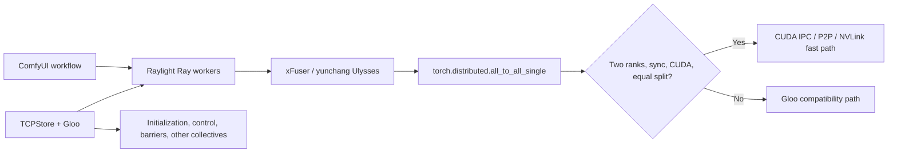

# Raylight Windows Dual-V100 CUDA P2P

[简体中文](README.md) | [English](README_EN.md)

> **Experimental Preview**
> A Raylight CUDA IPC/P2P communication branch for native Windows systems with
> two Tesla V100-SXM2-16GB GPUs, TCC mode, and NVLink. It is not a general NCCL
> replacement and does not provide FSDP on Windows.

This project gives eligible two-GPU Ulysses
`torch.distributed.all_to_all_single` calls a direct GPU data path. Instead of
staging CUDA tensors through host memory with Gloo, it transfers them through
CUDA IPC, interprocess CUDA events, and peer-to-peer GPU access. Gloo/TCPStore
still handles initialization, control, barriers, and collectives that do not
qualify for the fast path.

## Upstream and Authorship

This repository is an experimental branch of
[Raylight](https://github.com/komikndr/raylight), created and maintained
upstream by **Komikndr / Micko Lesmana**. Raylight manages multi-GPU ComfyUI
workers through Ray and integrates parallelism from xDiT/xFuser, yunchang, and
FSDP.

- Upstream repository: <https://github.com/komikndr/raylight>
- Upstream base for this branch: Raylight 1.9.0, commit
  `9a7c33d52b3d35e29f75ecff3c227de987f0d4cf`
- License: Apache License 2.0
- Branch change log: [WINDOWS_P2P_CHANGES.md](WINDOWS_P2P_CHANGES.md)

This project preserves the upstream license, copyright, and attribution. The
Windows P2P compatibility layer, tests, scripts, and documentation are
experimental additions maintained in this branch. They do not imply support or
endorsement from the upstream author.

## Project Scope

### Who this branch is for

This branch targets users who:

- Must run native Windows and do not want to migrate an established ComfyUI
  installation to WSL or Linux.
- Have two Tesla V100-SXM2-16GB GPUs running in TCC mode.
- Have working NVLink/CUDA peer access and want Raylight sequence-parallel
  traffic to use GPU P2P instead of host-memory staging.
- Accept that Ray on Windows is still Beta and remains less capable and often
  slower than Linux with NCCL.
- Can pin the validated software versions and run the complete preflight check
  before starting a workflow.

### What it provides

- A dedicated P2P fast path for synchronous, equally split, two-rank CUDA
  `all_to_all_single` calls used by Raylight.
- Gloo as the Windows-compatible process group, control plane, and fallback.
- Startup validation of both element correctness and real P2P bandwidth.
- Reuse of healthy Ray workers when the topology and configuration are
  unchanged, reducing repeated initialization overhead.
- Correctness, failure, and performance probes using actual LTX tensor sizes.

### What it is not

- It is not a replacement or fork of yunchang. yunchang still implements
  Ulysses attention and tensor partitioning.
- It is not a complete NCCL implementation for Windows.
- It is not a general-purpose PyTorch `ProcessGroup`.
- It does not enable FSDP on Windows, and two 16 GB GPUs do not become one
  transparent 32 GB device.
- USP primarily partitions sequence computation; model weights are normally
  still replicated on both GPUs.

## Supported Scope

### Fast-path requirements

| Item | Requirement |
|---|---|
| Operating system | Native 64-bit Windows, single host |
| GPUs | Exactly two visible CUDA GPUs |
| Validated model | 2× Tesla V100-SXM2-16GB |
| Driver mode | Both GPUs in TCC; WDDM is unsupported and untested |
| GPU communication | CUDA peer access, CUDA IPC, and interprocess CUDA events |
| Ray workers | Two workers / two ranks |
| Parallel configuration | Ulysses=2, Ring=1, CFG=1, DP=1 |
| Collective | Synchronous, CUDA, contiguous, equally split `all_to_all_single` |
| FSDP | Must be disabled |

Whether the GPUs are physically connected through one PCIe slot, a carrier, or
a bridge chip is not a software admission rule. The actual requirements are
working CUDA P2P and a passing correctness and bandwidth probe.

### Validated software matrix

| Component | Validated version |
|---|---|
| Windows | NT build 22631.6199 / 23H2 |
| NVIDIA driver | 577.00 |
| Python | 3.10.11 x64 |
| PyTorch | 2.7.0+cu126 |
| torchvision | 0.22.0+cu126 |
| torchaudio | 2.7.0+cu126 |
| xformers | 0.0.30 |
| Ray | 2.57.0 |
| xFuser | 0.4.5 |
| yunchang | 0.6.4 |
| ComfyUI | 0.31.0, commit `62b3c94bd45154f6486c7abf1b9efcacee96ea69` |
| Raylight upstream base | 1.9.0, commit `9a7c33d52b3d35e29f75ecff3c227de987f0d4cf` |
| Attention | `TORCH_EFFICIENT`, without FlashAttention |

See [environment-windows-v100.json](environment-windows-v100.json) for the
machine-readable matrix and
[requirements-windows-v100.txt](requirements-windows-v100.txt) for the pinned
Python dependencies.

## User Guide

### 1. Prepare the hardware and driver

Before continuing, confirm that:

1. Both V100 GPUs are in TCC mode.
2. `nvidia-smi nvlink -s` reports active links.
3. NVIDIA's `p2pBandwidthLatencyTest` passes peer-access, correctness, and
   bandwidth tests.
4. No old ComfyUI or Ray worker process is still occupying either GPU.

The development system exposes six approximately `25.781 GB/s` NVLink links per
V100. The full project probe measures about `59 GiB/s` of effective one-way
remote transfer bandwidth. Other topologies may work, but they must pass the
same preflight checks.

### 2. Install the pinned environment

Use an isolated Python 3.10.11 environment. Do not modify another working
ComfyUI installation in place.

```powershell
$PY = "<path to Python 3.10.11>\python.exe"
cd <ComfyUI>\custom_nodes
git clone --branch windows-v100-p2p `
  https://github.com/getsomefuns/raylight-windows-v100-p2p.git raylight

& $PY -m pip install -r .\raylight\requirements-windows-v100.txt
& $PY -m pip install -e .\raylight
```

Important notes:

- The validated V100 environment is pinned to `torch==2.7.0+cu126`.
- Do not install FlashAttention for this configuration.
- Do not substitute cu128 or cu130 PyTorch wheels. This branch is validated
  against the cu126 wheel that includes `sm_70` support.
- Upstream Raylight's broad dependency ranges do not guarantee long-term
  compatibility with the private PyTorch CUDA IPC interfaces used here. Use the
  pinned dependency file when reproducing this setup.

### 3. Run the environment preflight

First run the basic checks, which do not leave Ray workers active:

```powershell
cd <ComfyUI>\custom_nodes\raylight
.\scripts\verify-windows-v100.ps1 -PythonPath $PY
```

Then run the real two-actor CUDA P2P release gate:

```powershell
.\scripts\verify-windows-v100.ps1 -PythonPath $PY -RunP2PProbe
```

The full probe checks:

- Windows, Python, PyTorch, and key dependency versions.
- GPU count, model, and TCC mode.
- Visible NVLink links.
- Element correctness through CUDA IPC/P2P between two Ray actors.
- Whether a 115,343,360-byte real-world transfer reaches the default
  `50 GiB/s` threshold.

Do not start a large workflow if any check fails. Lowering the bandwidth gate
only removes a safety check; it does not improve the hardware path.

### 4. Start ComfyUI

Validate paths and launch arguments without starting the server:

```powershell
.\scripts\start-comfyui-windows-p2p.ps1 `
  -PythonPath $PY `
  -ValidateOnly
```

Start ComfyUI:

```powershell
.\scripts\start-comfyui-windows-p2p.ps1 -PythonPath $PY
```

The default address is:

```text
http://127.0.0.1:8188
```

The script supplies these key ComfyUI arguments:

```text
main.py --listen 127.0.0.1 --port 8188 --disable-cuda-malloc
```

`--disable-cuda-malloc` is required for the validated V100 VAE path to avoid
`cudaErrorNotSupported / operation not supported`. The default script does not
currently add `--highvram` or `--disable-smart-memory`.

### 5. Select the Gloo network interface

Gloo automatically selects a local IPv4 address by default. If Windows chooses
a VPN, Hyper-V, WSL, or TUN adapter, specify the physical adapter address:

```powershell
.\scripts\start-comfyui-windows-p2p.ps1 `
  -PythonPath $PY `
  -GlooHost <physical-adapter IPv4>
```

The repository does not contain the development machine's LAN address.

### 6. Load the LTX 2.3 example workflow

Example workflow:

[example_workflows/LTX2_3_i2v_Raylight_Windows_P2P.json](example_workflows/LTX2_3_i2v_Raylight_Windows_P2P.json)

Model and custom-node manifest:

[docs/ltx23-model-manifest.md](docs/ltx23-model-manifest.md)

The upstream example input image is retained in this repository:

[example_workflows/LTX2_3_i2v_Raylight.jpg](example_workflows/LTX2_3_i2v_Raylight.jpg)

Both the original and Windows P2P LTX workflows contain the test prompt and
reference this image filename. Before running the workflow, copy the image into
ComfyUI's `input` directory or select it again in the `Load Image` node. Model
weights are still not included and must be obtained separately from sources
approved by their respective authors.

Use these RayInitializer settings:

| Setting | Value |
|---|---:|
| GPU | 2 |
| ulysses_degree | 2 |
| ring_degree | 1 |
| cfg_degree | 1 |
| dp_degree | 1 |
| sync_ulysses | true |
| clear_vram_after_sampling | true |
| FSDP / FSDP_CPU_OFFLOAD | false / false |
| XFuser_attention | TORCH_EFFICIENT |
| skip_comm_test | true |
| use_mmap | false |

`skip_comm_test=true` skips Raylight's original generic communication test. It
does not skip this branch's CUDA P2P correctness and bandwidth checks.

### 7. Confirm that P2P is active

The first initialization should show messages similar to:

```text
[Raylight] Windows Gloo init OK ...
[Raylight] Windows CUDA P2P enabled: ...
```

Subsequent jobs with an unchanged configuration should show:

```text
[Raylight] Reusing 2 live Ray workers for unchanged configuration
```

If P2P initialization, correctness, or bandwidth validation fails, the
supported fast path reports an error. It does not silently stage the same
supported operation through host memory while claiming that NVLink is active.

## What the Start Script Configures

| Setting | Default | Purpose |
|---|---:|---|
| `PYTHONUTF8` | `1` | Consistent Windows and Ray log encoding |
| `PYTHONIOENCODING` | `utf-8` | Prevents corrupted worker output |
| `USE_LIBUV` | `0` | Uses TCPStore without a libuv dependency |
| `MASTER_ADDR` | `127.0.0.1` | Local distributed rendezvous |
| `MASTER_PORT` | `29500` | Rendezvous port |
| `RAY_DEBUG_DISABLE_MEMORY_MONITOR` | `1` | Prevents Ray from killing workers early under high memory use |
| `RAY_memory_usage_threshold` | `1` | Raises Ray's memory threshold to 100% |
| `RAYLIGHT_WINDOWS_P2P` | `1` | Enables the Windows CUDA P2P fast path |
| `RAYLIGHT_WINDOWS_P2P_CAPACITY_BYTES` | `67108864` | Persistent 64 MiB send buffer per rank |
| `RAYLIGHT_WINDOWS_P2P_MIN_GIB_S` | `50` | Hard startup bandwidth gate |
| `CUDA_VISIBLE_DEVICES` | `0,1` | Fixes the visible order of the two target GPUs |

Disabling Ray's memory monitor can allow the system to enter paging under
pressure. It prevents premature Ray termination for large workflows; it is not
a free performance optimization. Monitor system memory and the page file.

## Technical Notes

### Data path



yunchang/xFuser continues to call standard
`torch.distributed.all_to_all_single`. A router installed inside each Ray
worker intercepts only calls that meet all of these conditions:

- Input and output are both CUDA tensors.
- `async_op=False`.
- No explicit `input_split_sizes` or `output_split_sizes` are supplied.
- The process group world size is two.
- Tensors are contiguous, their dtypes and element counts match, and the remote
  half fits in the configured buffer.

Other calls keep the original Gloo implementation. If a matched fast-path call
fails, the endpoint is poisoned to prevent further execution with inconsistent
communication state.

### P2P implementation

The core implementation is in:

- `src/raylight/distributed_worker/windows_p2p.py`
- `src/raylight/distributed_worker/windows_gloo.py`
- `src/raylight/distributed_worker/ray_worker.py`
- `src/raylight/distributed_worker/parallel_group_manager.py`
- `src/raylight/nodes.py`

Each rank owns:

- One persistent CUDA send buffer, 64 MiB by default.
- An exportable CUDA IPC storage handle.
- Interprocess `ready` and `consumed` CUDA events.
- A Windows named shared-memory and event control plane.
- A dedicated CUDA stream, monotonically increasing operation ID, timeout, and
  poison state.

Each sender writes the remote half into its persistent buffer and records the
ready event. After both sides agree on the operation ID and transfer size, the
peer waits for the CUDA event and copies directly from the remote peer buffer
into its output tensor.

### What Gloo still handles

Gloo/TCPStore on Windows still handles:

- Rendezvous and process-group initialization for the two Ray workers.
- xFuser subgroup creation.
- Control, barriers, and collectives outside the fast-path contract.
- The Windows-compatible path for the communication tester.

The accurate description of this project is therefore a **Raylight Windows CUDA
P2P data-plane compatibility layer**, not “NCCL for Windows.”

### Ray worker reuse

RayInitializer generates a stable session key from topology, parallel settings,
GPU selection, and P2P/Gloo configuration. It reuses existing actors when the
configuration is unchanged and the workers pass health checks. A changed
configuration or failed health check clears the cache and initializes fresh
workers. This reduces Ray lifecycle overhead but does not guarantee that all
model weights remain resident on the GPUs.

## CUDA Version Notes

One machine can report three different CUDA versions:

- `nvidia-smi CUDA Version`: the highest CUDA API level supported by the driver.
- `nvcc --version`: the locally installed CUDA developer toolkit.
- `torch.version.cuda`: the CUDA runtime against which the PyTorch wheel was
  built.

The third value matters most for this project. The validated runtime is CUDA
12.6 through `torch==2.7.0+cu126`. The Python implementation does not compile a
custom CUDA extension, so running this branch does not itself require a local
CUDA Toolkit 12.9 installation. Building NVIDIA CUDA samples does require a
toolkit.

## Tests and Measured Results

### Release verification

- New Windows P2P, trace, session, and runtime unit tests: 18/18 passing.
- Real LTX tensor sizes: 516,096, 8,388,608, 28,835,840, and 115,343,360 bytes.
- Both ranks at every size: `0 mismatch / 0 maximum error`.
- Mismatched operation IDs and absent peers time out as expected in about two
  seconds.
- The xFuser two-rank subgroup integration probe passes.
- A 115,343,360-byte, 100-iteration P2P probe measures approximately
  `59.27 GiB/s` in each direction.

### LTX 2.3 end-to-end benchmark

Using the same models, input, prompt, and workflow dimensions:

| Scenario | End-to-end time |
|---|---:|
| Single V100 cold start | 519.94 s |
| Single V100 warm start | 316.60 s |
| Dual V100 P2P, reused-session median | 284.06 s |

The fair warm-to-warm improvement is:

```text
(316.60 - 284.06) / 316.60 = 10.28%
```

The current version demonstrates real dual-GPU execution, a correct CUDA P2P
data path, and stable generation. It has not yet reached the project goal of at
least 20% improvement over a warm single-GPU run. Cold-start single-GPU time is
not used to inflate the published speedup.

## Known Limitations

- Only a single host, two ranks, and equally split synchronous all-to-all use
  the fast path.
- WDDM is untested; the release gate requires TCC.
- FSDP must remain disabled on this Windows path.
- GGUF cannot gain FSDP weight sharding through this implementation.
- Text encoding and VAE encoding/decoding are not distributed across GPUs.
- Model weights are generally replicated, so VRAM does not add transparently.
- Python, named-control, synchronization, and event overhead remain significant
  for small tensors.
- Ray's Windows support is still Beta, with higher process startup and memory
  overhead than Linux.
- Other GPU models, drivers, and NVLink topologies require full hardware
  validation; compatibility must not be inferred from the model name alone.

## Troubleshooting

### The web interface does not open

Confirm that the launch window is still running, then check:

```powershell
Invoke-WebRequest http://127.0.0.1:8188/ -UseBasicParsing
```

No listener usually means that ComfyUI has not finished starting or has already
exited. Check the startup log before treating a web-interface issue as a
Raylight/P2P failure.

### `use_libuv was requested`

Use the repository start script. It sets `USE_LIBUV=0` and explicitly creates
`TCPStore(..., use_libuv=False)`.

### Gloo connects to `WorkStudio` or the wrong adapter

Use `-GlooHost <physical-adapter IPv4>`. Do not hard-code one machine's LAN
address in public scripts.

### P2P measures below 50 GiB/s

Check TCC mode, active NVLink links, peer access, GPU topology, and competing
GPU processes. Adjust `-MinimumP2PGiBs` only if you understand the performance
consequences.

### VAE reports `operation not supported`

Start through the project script and keep `--disable-cuda-malloc` enabled.

### Enabling FSDP causes an error

This is intentional. The Windows P2P branch does not implement FSDP. Disable
both FSDP and CPU offload.

## Repository Layout

```text
raylight/
├─ src/raylight/                         Raylight and Windows P2P implementation
├─ scripts/
│  ├─ start-comfyui-windows-p2p.ps1     Reusable start script
│  └─ verify-windows-v100.ps1           Environment and real P2P preflight
├─ tests/                                Unit tests and standalone probes
├─ example_workflows/                    LTX 2.3 example workflow
├─ docs/
│  ├─ windows-v100-p2p.md               Windows-specific technical guide
│  └─ ltx23-model-manifest.md            Model and custom-node manifest
├─ environment-windows-v100.json         Machine-readable validation matrix
├─ requirements-windows-v100.txt         Pinned dependencies
└─ WINDOWS_P2P_CHANGES.md                Changes relative to upstream
```

## Optimization Roadmap

- Raise the warm-to-warm end-to-end improvement above 20%.
- Explain and reduce the gap between the approximately 108 GiB/s microbenchmark
  and approximately 59 GiB/s in-project communication result.
- Reduce Python, control-plane, and synchronization overhead for small
  collectives.
- Evaluate multiple buffers/ring slots, batched control, and deeper pipelining.
- Reduce extra local copies while retaining strict correctness and timeout
  protection.
- Extend the support matrix only after validation on real hardware, rather than
  listing untested GPU models.

## Safe Redistributable Content

The repository contains source code, scripts, tests, configuration, and the
example workflows and companion assets published with the upstream project.
The original LTX 2.3 workflow, the Windows P2P test workflow, their embedded
prompt, and the upstream example input image are retained under
`example_workflows`.

The repository does not include:

- Model weights, LoRAs, VAEs, or text encoders.
- Generated test-video outputs.
- A complete Python or ComfyUI environment snapshot.

Users must obtain model weights and any assets not included in this repository
from authorized sources and comply with their respective licenses.

## License and Acknowledgements

This project continues to use Raylight's Apache License 2.0. See
[LICENSE](LICENSE).

Thanks to the following projects and their contributors:

- [Raylight](https://github.com/komikndr/raylight) — Komikndr / Micko Lesmana
- [xDiT / xFuser](https://github.com/xdit-project/xDiT)
- [yunchang / Long Context Attention](https://github.com/feifeibear/long-context-attention)
- [Ray](https://github.com/ray-project/ray)
- [PyTorch](https://github.com/pytorch/pytorch)
- [ComfyUI](https://github.com/Comfy-Org/ComfyUI)

When reporting an issue, include the environment verification output, relevant
error logs, RayInitializer settings, and a minimal reproducing workflow. Remove
tokens, personal paths, images, and model-download credentials first.
